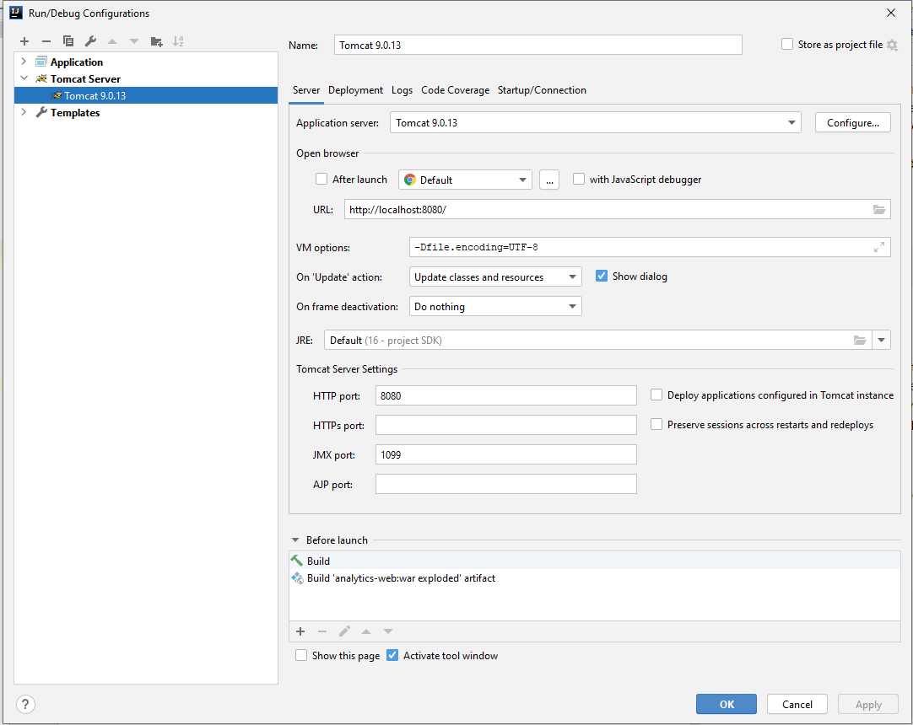
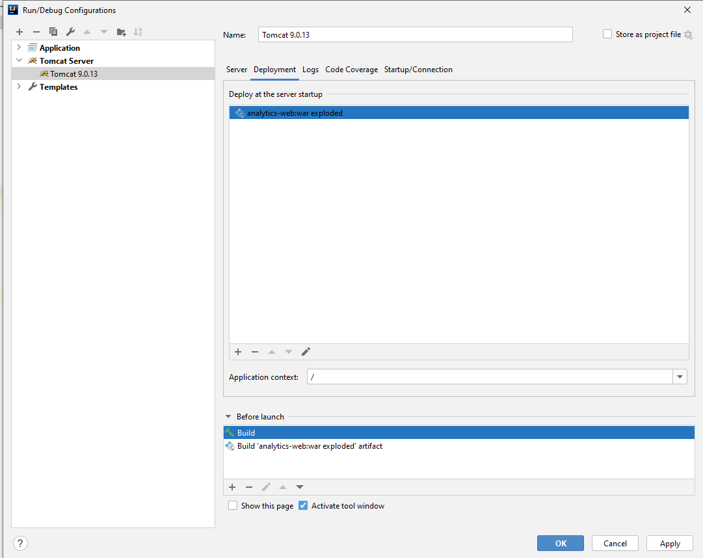

# Аналитика

## Необходимый софт

1. **Java 16** или выше\
   [https://download.java.net/openjdk/jdk16/ri/openjdk-16+36_windows-x64_bin.zip]
2. **Tomcat 9**\
   [https://dlcdn.apache.org/tomcat/tomcat-9/v9.0.68/bin/apache-tomcat-9.0.68.zip]
3. Apache **Maven 3.8.1** или выше\
   [https://maven.apache.org/download.cgi]
4. PostgresSQL 10 или выше (рекомендуется **Postgres 12**)\
   [https://www.enterprisedb.com/downloads/postgres-postgresql-downloads]
5. Node.js v14.17.4 или выше\
   [https://nodejs.org/en/download/]

## Сборка и запуск

    cd <Директория с проектом>

### Создание БД

1. Отройте PgAdmin
2. Создайте пользователя analytics / analytics
3. Создайте БД analytics -> owner пользователь analytics
4. Далее откройте "Query Tool" и испольните скрипт из файла 
   **analytics-dao\src\main\resources\dump.sql**

### Сборка бакенда

   Убедитесь, что у Вас стоит переменная среды **JAVA_HOME**

   mvn clean install

### Сборка фронта
   
      cd frontendFiles

      npm install gulp-cli@2.3.0 -g

      npm install

      gulp buildStyles

### Запуск приложения 

Далее описан запуск приложения для разработчиков с помощью Intellij Idea
При запуске приложения выбрать Edit configuration -> Local Tomcat

 \

### Ссылка на приложение

####Приложение можно открыть по адресу
http://localhost:8080

#### Рабочий прототип
https://analytics.stvolov.site

